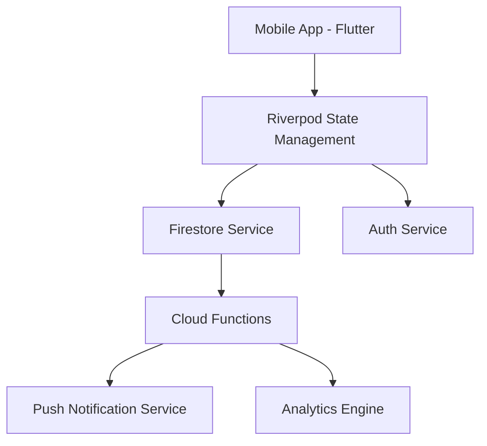

# 🔨 HabitForge

**Forge powerful habits one day at a time.**

[](https://play.google.com/store)
[](https://opensource.org/licenses/MIT)
[](https://github.com/nayrbryanGaming/habitforge)

---

## 🌩️ Vision
**HabitForge** isn't just a tracker; it's a behavioral engine. Designed for the 1%, it transforms the friction of self-improvement into the momentum of a daily routine. Using streak psychology and hyper-contextual reminders, we help you forge habits that actually stick.

## 🚀 Key Features

### 💎 Zen Luxury UI
A glassmorphic dashboard designed for clarity. No clutter, just your mission for the day. Animated with micro-interactions that make completion feel rewarding.

### 🔥 Streak Master Engine
Our proprietary momentum tracker uses loss-aversion psychology to motivate you. Watch your fire grow as you forge consecutive days of excellence.

### 📊 Deep Analytics
Don't just track—understand. High-fidelity heatmaps and success-rate trends give you a biological mirror of your consistency.

### 🔔 Smart Forge Reminders
Hyper-contextual notifications that prompt you at the absolute peak of your daily habit window.

### 🛡️ Privacy First
Local-first data architecture with encrypted cloud sync. Fully compliant with GDPR and Google Play Data Safety standards.

---

## 🛠️ Tech Stack

### Frontend & Core
- **Framework**: [Flutter](https://flutter.dev) (Latest Stable)
- **State management**: [Riverpod](https://riverpod.dev)
- **Navigation**: [GoRouter](https://pub.dev/packages/go_router)
- **Animations**: [flutter_animate](https://pub.dev/packages/flutter_animate) & [Lottie](https://pub.dev/packages/lottie)

### Backend (Firebase)
- **Auth**: Firebase Authentication (Google, Email)
- **Database**: Cloud Firestore
- **Serverless**: Cloud Functions (Node.js)
- **Cloud Messaging**: FCM (Push Notifications)
- **Analytics**: Firebase Analytics & Crashlytics

---

## 🏗️ System Architecture

Modular Feature-based Architecture for scalability:


---

## 📦 Project Structure

| Folder | Description |
| :--- | :--- |
| `mobile_app/` | Flutter Source Code (Core, Features, Models, Widgets) |
| `backend/` | Firebase Cloud Functions and Service configurations |
| `landing_page/` | Next.js Marketing Site (Vercel Ready) |
| `legal/` | Production-ready Privacy Policy, ToS, and Data Safety docs |
| `docs/` | Deep-dive Architecture, API, and Strategy guides |
| `assets/` | High-res Logo, Screenshots, and Branding assets |

---

## ⚡ Quick Start

### 1. Prerequisites
- Flutter SDK (3.x+)
- Node.js (for Functions/Landing Page)
- Firebase Account

### 2. Installation
```bash
# Clone the repository
git clone https://github.com/nayrbryanGaming/habitforge

# Install Flutter dependencies
cd mobile_app
flutter pub get

# Setup Firebase (Mandatory)
# Add your google-services.json to android/app/
# Add your GoogleService-Info.plist to ios/Runner/
```

---

## 🛡️ Compliance & Safety
HabitForge is built for immediate Play Store approval:
- **Mandatory Account Deletion**: Fully automated Firestore & Auth purge flow.
- **Data Transparency**: All collection points are documented in our [Privacy Policy](legal/privacy_policy.md).
- **Minimum Functionality**: A feature-rich suite that exceeds Google's "Minimum Functionality" policy.

---

## 🤝 Contributing
Forged by the community. Join the movement. Check our [Architecture Guide](docs/architecture.md) for contribution rules.

## 📄 License
Released under the [MIT License](LICENSE). 
Copyright © 2026 HabitForge Team.

