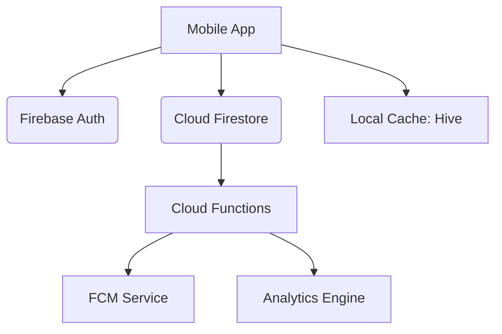

# HabitForge ⚒️

[](https://github.com/nayrbryanGaming/habitforge)
[](https://flutter.dev)
[](https://opensource.org/licenses/MIT)

> **Forge powerful habits, one day at a time.**

HabitForge is a clinical-grade habit tracking application built with Flutter and Firebase. Unlike generic tracking apps, HabitForge leverages behavioral psychology and "Streak Reinforcement" to transform intentions into long-term discipline.

---

## 🚀 The Vision

Consistency is the raw material of greatness. HabitForge provides the "Forge" where users can refine their daily rituals, track their progress with high-fidelity analytics, and maintain discipline through an advanced reminder intelligence system.

### The Problem
Most habit trackers fail because they are:
- **Mechanically Complex**: Too many steps to log a simple success.
- **Data Blind**: Lack of actionable insights into behavioral patterns.
- **Zero Retention**: No motivation mechanics beyond simple checkboxes.

### The Solution: HabitForge
- **Minimalist Friction**: Log a habit in under 2 seconds.
- **Behavioral Insights**: Heatmaps and streak analysis to identify peaks and plateaus.
- **Atomic Reinforcement**: Haptic success loops and smart reminders.

---

## ✨ Core Features

| Feature | Description |
| :--- | :--- |
| **Atomic Forge** | Create daily or weekly habits with custom scheduling. |
| **Streak Engine** | Timezone-resilient streak calculation and "Lit" status. |
| **Mastery Dashboard** | Weekly and monthly progress charts using `fl_chart`. |
| **Smart Reminders** | High-priority local and push notifications. |
| **Cloud Sync** | Seamless data persistence across devices via Firestore. |
| **Privacy First** | Atomic Account Purge (Right to Erasure) compliance. |

---

## 🛠 Tech Stack

- **Frontend**: Flutter (3.x) & Dart
- **State Management**: Riverpod (Modular Architecture)
- **Local Cache**: Hive & SharedPreferences
- **Backend Infrastructure**:
    - **Authentication**: Firebase Auth (Google/Email)
    - **Database**: Cloud Firestore
    - **Push Notifications**: Firebase Cloud Messaging (FCM)
    - **Analytics**: Google Analytics for Firebase
    - **Logic**: Firebase Cloud Functions (Node.js)

---

## 🏗 System Architecture

HabitForge follows a **Feature-Based Modular Architecture** for maximum scalability and maintainability.



---

## 📦 Project Structure

```bash
habitforge/
├── mobile_app/         # Flutter Core Application
│   ├── lib/
│   │   ├── core/       # Constants, Themes, Services, Utils
│   │   ├── features/   # Auth, HabitTracking, Analytics, Reminders
│   │   ├── models/     # Data Models (Freezed/JSON)
│   │   └── widgets/    # Reusable UI Components
├── backend/            # Firebase Functions & Services
├── landing_page/       # Next.js / React Landing Page
├── legal/              # Compliance Documentation (HTML/MD)
└── assets/             # Branding Assets & Logo Prompt
```

---

## ⚙️ Installation

1.  **Clone the Repository**
    ```bash
    git clone https://github.com/nayrbryanGaming/habitforge.git
    ```
2.  **Initialize Flutter**
    ```bash
    cd mobile_app
    flutter pub get
    ```
3.  **Setup Firebase**
    - Create a project on the [Firebase Console](https://console.firebase.google.com/).
    - Download `google-services.json` (Android) and `GoogleService-Info.plist` (iOS).
    - Place them in their respective platform directories.
4.  **Run the App**
    ```bash
    flutter run
    ```

---

## 💳 Monetization Strategy (Freemium)

- **Standard (Free)**: Up to 5 Habits, Basic Analytics, Standard Reminders.
- **HabitForge Pro ($4.99/mo)**: Unlimited Habits, Advanced AI Insights, iCloud/Drive Cloud Backup, Priority Support.

---

## ⚖️ Legal & Compliance

HabitForge is explicitly designed to meet **Google Play Data Safety** requirements:
- Full **Privacy Policy** available in `/legal/privacy_policy.html`.
- **Right to Erasure** implemented via in-app "Delete Account" flow.
- No third-party data selling.

---

## 🛣 Roadmap

- [x] v1.0.0: Core Forge Engine
- [ ] v1.1.0: Apple Watch & Widget Integration
- [ ] v1.2.0: AI-Driven Habit Recommendations
- [ ] v1.5.0: Community Challenges & Buddies

---

## 🤝 Contributing

We welcome professional community contributions that align with the "Masterpiece" engineering standard. Please open an issue first to discuss your proposal.

---

## 📄 License

This project is licensed under the MIT License.


---

**Built with ❤️ for Discipline Builders.**
